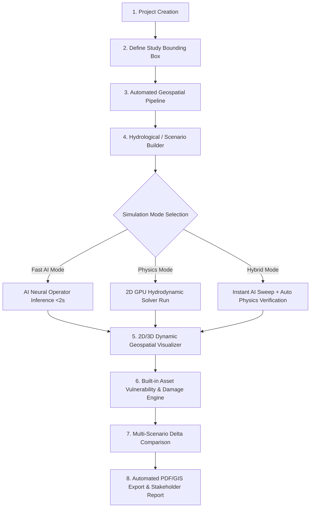
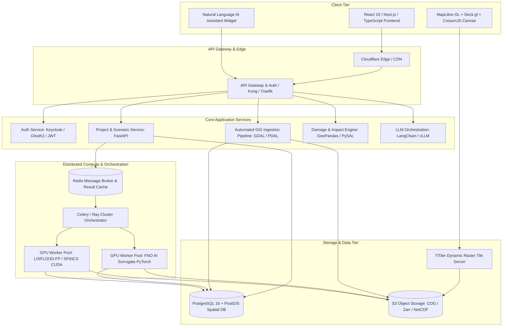
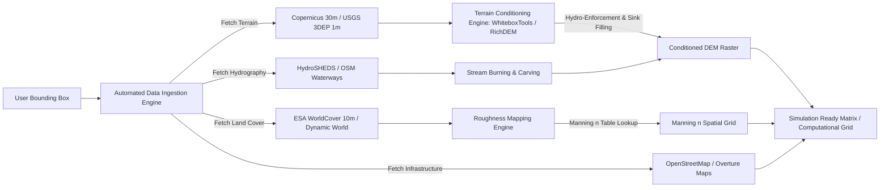
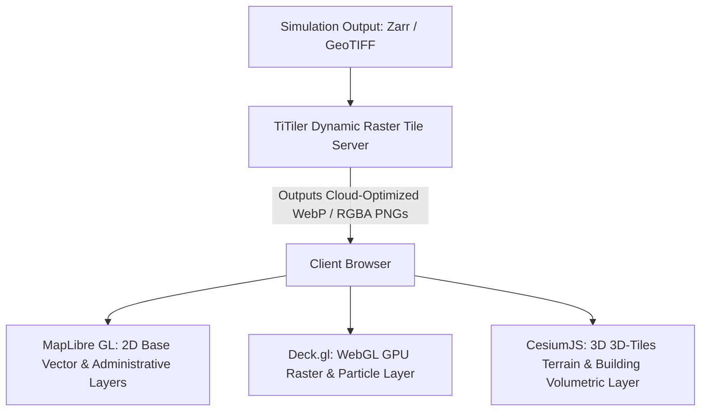

# HYDROFORGE AI: HYBRID PHYSICS + AI FLOOD SIMULATION & DECISION SUPPORT PLATFORM
## Master Product Architecture, Technical Design & Engineering Blueprint

---

# 1. EXECUTIVE SUMMARY

Flooding is the most frequent, destructive, and economically devastating natural disaster globally, causing over \$50 billion in annual economic losses and affecting hundreds of millions of lives. Traditional hydraulic and hydrodynamic modeling tools (e.g., HEC-RAS, TUFLOW, MIKE FLOOD) provide rigorous physics-based numerical accuracy but suffer from severe operational bottlenecks: they require weeks of manual data acquisition and mesh preparation, demand specialized hydraulic engineering expertise, and exhibit massive computational runtimes (hours to days for a single multi-kilometer 2D hydrodynamic simulation). Conversely, purely data-driven black-box machine learning approaches often suffer from poor spatial generalization, violate fundamental physical conservation laws (mass, momentum), and fail during extreme, out-of-distribution flood events.

**HydroForge AI** is an enterprise-grade, stand-alone **Hybrid Physics + AI Flood Simulation, Visualization, and Decision Support Platform**. The platform unites the mathematical reliability of 2D hydrodynamic physics solvers with the near-instantaneous inference speed of state-of-the-art neural operators (Fourier Neural Operators, DeepONet, and Physics-Informed Neural Networks). 

By coupling automated geospatial data ingestion (satellite imagery, Copernicus DEM, OpenStreetMap, hydrodynamic gauge networks) with a distributed, GPU-accelerated computing core and real-time WebGL/3D geospatial visualization, **HydroForge AI** reduces flood model setup and execution time from **weeks to under 3 minutes** for rapid scenario exploration, while retaining one-click access to full engineering-grade hydrodynamic physics.

```
                      +-------------------------------------------------------+
                      |                    HYDROFORGE AI                      |
                      |    Hybrid Physics + AI Decision Support Platform      |
                      +-------------------------------------------------------+
                                                  |
           +--------------------------------------+--------------------------------------+
           |                                                                             |
+--------------------------+                                                 +--------------------------+
|      FAST AI MODE        | <============== AUTOMATIC FALLBACK ===========> |       PHYSICS MODE       |
|  Neural Operator / FNO   |                                                 |  2D Hydrodynamic Solver  |
|  ~50-250ms Inference     | <----------- CALIBRATION & TRAINING ----------- |  (LISFLOOD-FP / SFINCS)  |
|  Interactive Sweeps & UI |                                                 |  Full SWE Conservation   |
+--------------------------+                                                 +--------------------------+
           |                                                                             |
           +--------------------------------------+--------------------------------------+
                                                  |
                                                  v
                      +-------------------------------------------------------+
                      |         UNIFIED DECISION INTELLIGENCE LAYER           |
                      |  * 2D/3D Temporal Flood Propagation (Depth, Velocity) |
                      |  * Asset-Level Damage & Critical Infra Failure Paths  |
                      |  * Natural Language Scenario & Parameter Orchestration|
                      +-------------------------------------------------------+
```

### Key Highlights:
1. **Automated GIS-to-Mesh Pipeline**: Converts raw bounding box coordinates into fully hydrologically conditioned, roughness-attributed digital elevation models and river cross-sections automatically.
2. **Dual-Core Execution Engine**: Fast AI surrogate mode (sub-second what-if sweeps) paired with physical 2D shallow water solvers (LISFLOOD-FP / SFINCS) for official regulatory compliance and engineering sign-off.
3. **Hyper-Realistic 3D & Temporal Visualization**: Browser-based WebGL/WebGPU rendering utilizing Deck.gl, CesiumJS, and MapLibre GL for dynamic water surface rendering, velocity particle vector fields, and arrival-time contours.
4. **Vulnerability & Economic Damage Engine**: Built-in depth-damage curves (USACE HAZUS-MH / European Commission JRC) computing building structural losses, road passability, and emergency facility isolation in real time.
5. **Conversational Co-Pilot**: Context-aware LLM reasoning agent capable of translating unstructured natural language inquiries ("*What happens to the hospital access if rainfall intensifies by 25% over the northern ridge?*") into strict, validated hydrodynamic boundary configurations.

---

# 2. PROBLEM STATEMENT

### The Status Quo Bottlenecks
Modern flood risk management is paralyzed by three critical friction points:

1. **Labor-Intensive Model Preparation**: Creating a flood model currently demands 40 to 120 hours of manual GIS preprocessing: downloading DEM tiles, burning stream networks, correcting topological sinks, delineating catchments, assigning Manning's roughness coefficients from land-use rasters, and setting boundary hydrographs.
2. **High Computational Latency**: Standard 2D shallow water equation (SWE) solvers solve millions of non-linear partial differential equations across numerical grids. Running a 48-hour flood wave simulation across a $500\text{ km}^2$ catchment at $5\text{m}$ resolution takes 6 to 36 hours on multi-core CPU workstations. This completely prevents real-time emergency response and wide-parameter Monte Carlo scenario sweeps.
3. **Siloed Insights & Non-Specialist Inaccessibility**: Existing hydraulic engineering software outputs complex binary files (HDF5, NetCDF, DAT) that require GIS technicians to translate into static PDF maps. Municipal planners, insurance underwriters, and emergency incident commanders cannot interact with live scenarios or query impact dynamics in real time.

```
Existing Legacy Workflow (40 - 120+ Hours):
[Manual Data Hunting] -> [GIS Scrubbing & Sinks] -> [Manual Mesh Building] -> [Overnight CPU Run] -> [Static PDF Risk Map]

HydroForge AI Automated Workflow (< 3 Minutes):
[BBox Selection] -> [Auto Data Ingestion & Condition] -> [Instant AI Sweep / Physics Run] -> [Dynamic 3D Web Visualization & Decision Analytics]
```

---

# 3. MARKET & EXISTING SOLUTIONS

To establish a defensible product strategy, we conduct a comprehensive architectural, hydrodynamic, and commercial evaluation of the current landscape across physical solvers, commercial suites, and emerging AI/ML models.

### Comparative Technology Matrix

| Solution / Technology | Type & License | Spatial Domain | Compute Reqs | Strengths | Critical Weaknesses | Integration Potential | MVP Role |
| :--- | :--- | :--- | :--- | :--- | :--- | :--- | :--- |
| **HEC-RAS (USACE)** | Open Access / C++ (Proprietary source) | 1D / 2D SWE & Diffusion Wave | Multi-core CPU; Experimental GPU | Global gold standard; free; trusted by regulators. | Closed CLI orchestration; difficult automated containerization; slow 2D SWE on complex meshes. | Medium (via HEC-RAS Controller COM / PyRAS / HDF5 extraction). | Secondary benchmark engine (non-core for MVP container). |
| **LISFLOOD-FP** | Open Source (GPLv3 / Academic) | 1D / 2D Subgrid / ACC Shallow Water | Highly optimized C++ / OpenMP & CUDA GPU | Extremely fast 2D inertial wave formulation; subgrid channel physics; natively scriptable. | Limited native GUI; requires external pre/post-processing pipelines. | **High** (Modular CLI, NetCDF/GeoTIFF I/O, native CUDA acceleration). | **Core Physics Engine for MVP**. |
| **SFINCS (Deltares)** | Open Source (GPL-3.0) | 2D Coastal / Fluvial / Pluvial | CPU & GPU (CUDA) | Designed specifically for rapid compound flood simulations (100x faster than full SWE). | Approximates advection terms (inertial approximation); less suited for steep hydraulic jumps. | **High** (Lightweight binary, rapid execution, NetCDF standard). | **Co-Primary Physics Engine for MVP**. |
| **TUFLOW (BMT)** | Commercial / Proprietary | 1D / 2D / 3D Flexible Mesh | Multi-GPU (Nvidia CUDA) | Premier industrial solver; exceptional subgrid sampling and urban drainage integration. | Expensive licensing dongles/cloud seats; impossible to embed in multi-tenant SaaS without per-seat license costs. | Low (Commercial license blocker). | None (Competitor benchmark only). |
| **TELEMAC-2D** | Open Source (GPLv3) | 2D Finite Element / Volume | HPC Cluster / MPI Linux | Highly accurate triangular unstructured mesh; coastal and river hydrodynamics. | Heavy pre-processing mesh requirements (BlueKenue/Salome); high memory overhead. | Medium (Containerizable, but high mesh generation latency). | Future Phase (Large estuarine & coastal scale). |
| **MIKE FLOOD / MIKE+ (DHI)** | Commercial / Proprietary | 1D Pipe + 2D Surface | Multi-core CPU & GPU | Comprehensive 1D pipe network (SWMM/MIKE Urban) coupled with 2D overland flow. | Prohibitive enterprise licensing; closed ecosystem; heavy desktop footprint. | Low (Commercial licensing blocker). | None (Competitor benchmark only). |
| **3Di (Nelen & Schuurmans)** | Commercial SaaS | 2D Subgrid SWE | Proprietary Cloud GPU | Fast quadtree subgrid method; excellent interactive web dashboard. | Closed commercial SaaS; high enterprise subscription costs; no customer-accessible AI surrogate layer. | None (Direct commercial SaaS competitor). | Competitor benchmark. |
| **Google Flood Hub** | Proprietary Free Public Good | 1D River Discharge Routing | Google TPU Cloud | Global coverage; great hydrological gauge ML forecasting (LSTM-based). | Gauged river reaches only; lacks localized 2D inundation physics, overland pluvial flow, and building-level depth-damage calculations. | Low (Data feed consumer only). | Complementary river discharge data source. |
| **Fourier Neural Operators (FNO)** | Open Research (PyTorch) | 2D/3D Continuous Domain | Fast GPU Training; ultra-fast GPU/CPU Inference | Zero-shot super-resolution; meshes-independent; learns operator across function spaces; 1000x faster than SWE. | Requires large synthetic physical simulation datasets for training; boundary condition drift on unseen topographies. | **High** (Core architecture for HydroForge AI Surrogate). | **Core AI Architecture**. |
| **U-Net / ConvLSTM Surrogates** | Open Research (PyTorch) | 2D Pixel Grid | Moderate GPU | Excellent local spatial feature extraction; rapid image-to-image depth map translation. | Fixed spatial resolution; poor generalization to unfamiliar topography outside bounding box. | High (Strong baseline for fixed-domain catchments). | Comparative baseline in Phase 2. |
| **Physics-Informed Neural Networks (PINN)** | Open Research | Point-wise 2D SWE | High Training GPU; zero training data required | Enforces exact conservation of mass and momentum via PDE residual loss. | Training takes longer than physical solver; fails on discontinuous shocks / hydraulic jumps without severe curriculum training. | Medium (Used for physics-loss regularization in Neural Operators). | Hybrid loss constraint function. |

---

# 4. PROPOSED PRODUCT DEFINITION

### Product Identity
- **Product Name**: **HydroForge AI** (Alternative: *Aqueon Dynamics*, *FloodPulse OS*)
- **One-Line Value Proposition**: *"From coordinates to calibrated 2D/3D flood impact intelligence in under three minutes—powered by hybrid physics and neural operators."*

### Target Personas & Industries
- **Civil & Hydraulic Engineers**: Demand full SWE physics, 1D/2D coupling, subgrid channel bathymetry, and exportable NetCDF/DAT models.
- **Disaster Management Authorities (FEMA, Civil Protection)**: Demand real-time scenario exploration, asset-level isolation warnings, and dynamic evacuation route passability.
- **Municipal Urban Planners**: Demand zoning risk calculations, retention basin sizing, and stormwater capacity optimization.
- **InsurTech & Catastrophe Risk Modelers**: Demand portfolio-level depth-damage calculations, Average Annualized Loss (AAL), and return-period comparisons.

---

# 5. USER EXPERIENCE & WORKFLOW DESIGN

The complete user workflow is structured as a frictionless, linear progression with real-time feedback loops.



### Comprehensive Specification of All 17 Core Screens

1. **Login & Organization Dashboard**: Enterprise SSO, role permissions, workspace isolation, GPU quota management.
2. **Project Dashboard**: Scenario cards, DEM status, past run timeline, quick action triggers.
3. **Geographic Area Selection**: MapLibre canvas, interactive bounding box / polygon draw, OSM geocoder, area size validation ($<500\text{ km}^2$).
4. **Data Management**: Layer stack (DEM, Roughness, Hydrography, Buildings), Cloud asset sync, custom raster upload with auto-reprojection.
5. **Terrain / GIS Viewer**: 3D terrain canvas, sink-filling validation, stream burning preview, Manning $n$ visualization.
6. **Scenario Builder**: Rainfall IDF selector, hyetograph editor, return period presets (10/50/100/500-yr), dam breach parameterizer.
7. **Simulation Configuration**: Engine selector (Fast AI vs Physics vs Hybrid), mesh resolution slider ($1\text{m} - 30\text{m}$), CFL controls.
8. **Simulation Progress**: Live streaming solver logs, residual convergence chart, GPU telemetry, cancel/pause triggers.
9. **Interactive 2D Flood Map**: WebGL raster tile streaming, dynamic color-ramp depth shader, velocity stream particles, point probe.
10. **3D Flood Visualization**: CesiumJS 3D terrain, photorealistic water shader, 3D extruded building flood intersection lines.
11. **Time-Series Flood Animation**: Dynamic temporal scrubber, playback speed multiplier, cumulative inundated area ticker.
12. **Scenario Comparison**: Synchronized split-screen swipe curtain, difference raster calculation ($\Delta \text{Depth}$), delta damage table.
13. **Risk & Impact Dashboard**: KPI summary cards (Total Loss \$, Displaced Population, Inundated Area), land-use damage distribution.
14. **Infrastructure Vulnerability Analysis**: Critical facility isolation times (Hospitals, Substations), road passability network graph.
15. **Natural Language AI Assistant Panel**: Prompt-to-scenario generator, context-grounded Q&A, highlighted entity spatial deep-links.
16. **Reports & Exports Hub**: FEMA/JRC regulatory templates, multi-format GIS downloads (GeoTIFF, GeoJSON, NetCDF, CSV, Shapefile).
17. **Administration & Compute Settings**: API keys, webhooks, GPU worker node health, custom depth-damage curves, FNO model versioning.

---

# 6. SYSTEM ARCHITECTURE & HIGH-PERFORMANCE COMPUTING



---

# 7. GIS & AUTOMATED DATA INGESTION ARCHITECTURE

The automated GIS microservice transforms raw bounding box coordinates into simulation-ready computational meshes in under 30 seconds:



### Data Sources Specification

| Layer | Source / API | Resolution | Coverage | Licensing | MVP Role |
| :--- | :--- | :--- | :--- | :--- | :--- |
| **Terrain (Global)** | Copernicus GLO-30 STAC API | 30m | Global | Open Data / CC-BY | **Core Default DEM** |
| **Terrain (High-Res)** | USGS 3DEP / OpenTopography | 1m - 3m | US / Select | Public Domain | High-res tier |
| **Land Cover** | ESA WorldCover / Dynamic World | 10m | Global | CC-BY 4.0 | **Core Roughness Source** |
| **Rivers & Streams** | HydroSHEDS / OSM Waterways | Vector | Global | Open Data / ODbL | **Core Stream Burning** |
| **Buildings & Roads** | OpenStreetMap / Overture Maps | Vector | Global | ODbL / CDLA | **Core Asset Vulnerability** |
| **Rainfall IDF** | NOAA Atlas 14 / ERA5 Reanalysis| Hourly / Gridded| Global | Public Domain | **Core Scenario Hydrology** |

---

# 8. HYDRAULIC SIMULATION ARCHITECTURE (PHYSICS ENGINE)

### Governing Equations (2D Shallow Water Equations)
$$\frac{\partial h}{\partial t} + \frac{\partial (hu)}{\partial x} + \frac{\partial (hv)}{\partial y} = R - I$$

$$\frac{\partial (hu)}{\partial t} + \frac{\partial}{\partial x} \left( hu^2 + \frac{1}{2} g h^2 \right) + \frac{\partial (huv)}{\partial y} = - gh \frac{\partial z_b}{\partial x} - \frac{\tau_{bx}}{\rho}$$

$$\frac{\partial (hv)}{\partial t} + \frac{\partial (huv)}{\partial x} + \frac{\partial}{\partial y} \left( hv^2 + \frac{1}{2} g h^2 \right) = - gh \frac{\partial z_b}{\partial y} - \frac{\tau_{by}}{\rho}$$

### Selected Physics Engines: **LISFLOOD-FP + SFINCS**
- **LISFLOOD-FP**: Subgrid channel inertial solver executing on NVIDIA CUDA GPUs. Fast, robust, and handles pluvial overland and fluvial inundation.
- **SFINCS**: Compound flood solver (river + storm surge + coastal boundaries).
- Containerized via Docker + CUDA, managed through Celery queues with real-time NetCDF output parsing.

---

# 9. AI / ML ARCHITECTURE & SURROGATE MODELING

HydroForge AI implements **Geographic Fourier Neural Operators (Geo-FNO)** to learn the mapping between topographical/meteorological inputs and dynamic flood wave propagation.

```
+---------------------------------------------------------------------------------------------------------------+
| GEOGRAPHIC FOURIER NEURAL OPERATOR (Geo-FNO) BACKBONE:                                                        |
|                                                                                                               |
| Inputs: [DEM z_b, Slope Grad(z_b), Manning n, Precip P(t), Upstream Inflow Q(t)]                              |
|                                                       |                                                       |
|                                                       v                                                       |
| Input Lifting Layer: Linear Projection P from R^5 -> R^d (High-dimensional latent space)                     |
|                                                       |                                                       |
|                                                       v                                                       |
| 6x Fourier Neural Operator Spectral Convolution Blocks:                                                       |
|   v_t+1(x) = GELU( W * v_t(x) + IFFT( R_k * FFT( v_t(x) ) ) )                                                 |
|                                                       |                                                       |
|                                                       v                                                       |
| Output Projection Layer: Linear Mapping Q from R^d -> R^3 [Depth h(x,y,t), Velocity u(x,y,t), Velocity v(x,y,t)]|
+---------------------------------------------------------------------------------------------------------------+
```

### Composite Physics-Regularized Loss Function
$$\mathcal{L}_{\text{total}} = \mathcal{L}_{\text{depth}}(h, \hat{h}) + \lambda_v \mathcal{L}_{\text{vel}}(u, v, \hat{u}, \hat{v}) + \lambda_{\text{mass}} \mathcal{L}_{\text{mass\_conservation}} + \lambda_{\text{pde}} \mathcal{L}_{\text{SWE\_residual}}$$

---

# 10. HYBRID AI + PHYSICS STRATEGY

```
+---------------------------------------------------------------------------------------------------------------+
|                                    TRIPLE-MODE EXECUTION STRATEGY                                             |
+---------------------------------------------------------------------------------------------------------------+
| [MODE 1: FAST AI MODE]                                                                                        |
| * Latency: < 2 seconds.                                                                                       |
| * Use Case: Real-time emergency planning, interactive slider manipulation, 1,000-run Monte Carlo sweeps.     |
| * Mechanism: Direct neural operator inference on GPU/CPU.                                                    |
| * Safety Guardrail: Displays prominent "AI PREDICTIVE SURROGATE" watermark with instant confidence score.    |
+---------------------------------------------------------------------------------------------------------------+
| [MODE 2: PHYSICS MODE]                                                                                        |
| * Latency: 2 to 15 minutes (depending on catchment size and mesh resolution).                                |
| * Use Case: Official regulatory reporting, structural engineering sign-off, legal insurance certifications.  |
| * Mechanism: Full 2D Shallow Water Equations solver execution (LISFLOOD-FP / SFINCS).                        |
| * Safety Guardrail: Produces mass-conservation error audits and numerical convergence certificates.          |
+---------------------------------------------------------------------------------------------------------------+
| [MODE 3: HYBRID CO-PILOT MODE (RECOMMENDED)]                                                                 |
| * Latency: Instant initial UI render (< 2s) + Async physics validation in background (3 mins).                |
| * Mechanism: Instant AI render followed by background physics verification and automatic residual delta check.|
+---------------------------------------------------------------------------------------------------------------+
```

---

# 11. VISUALIZATION & DYNAMIC RENDERING ARCHITECTURE



- **Dynamic Color-Ramp WebGL Shaders**: Decode 16-bit depth values client-side on the GPU.
- **Particle Vector Fields**: Real-time velocity streamlines rendered via GPU instancing in `Deck.gl`.
- **Volumetric 3D Water**: Water Surface Elevation ($\text{WSE} = z_b + h$) rendered in CesiumJS with dynamic Fresnel reflection/refraction shaders.

---

# 12. IMPACT, ASSET VULNERABILITY & DAMAGE ENGINE

Building structural loss is modeled using USACE HAZUS-MH / European Commission JRC depth-damage functions:

$$\text{Loss}_i = \text{Replacement Value}_i \times f_{\text{typology}}(h_i)$$

Road network passability is dynamically classified:
$$\text{Passability}(e) = 
\begin{cases} 
\text{Fully Passable} & \text{if } h_{\text{peak}} < 0.15\text{ m} \text{ and } v < 1.0\text{ m/s} \\
\text{Emergency / 4WD Only} & \text{if } 0.15\text{ m} \le h_{\text{peak}} < 0.30\text{ m} \text{ and } h \cdot v < 0.3\text{ m}^2/\text{s} \\
\text{Impassable / Severed} & \text{if } h_{\text{peak}} \ge 0.30\text{ m} \text{ or } h \cdot v \ge 0.3\text{ m}^2/\text{s}
\end{cases}$$

---

# 13. NATURAL LANGUAGE AI ASSISTANT

- **Role**: Natural language parameter orchestrator and context-aware insights summarizer.
- **Strict Guardrail**: The LLM *never* computes flood propagation internally. It translates prompts to validated JSON scenario configurations, triggers the simulation engine, and summarizes spatial results using PostGIS spatial queries.

---

# 14. DATABASE DESIGN (POSTGRESQL + POSTGIS)

Comprehensive schema with 19+ entities:
- `organizations`, `users`, `projects`, `study_areas`, `dem_datasets`, `roughness_layers`, `scenarios`, `simulations`, `simulation_runs`, `simulation_artifacts`, `buildings`, `roads`, `critical_infrastructure`, `impact_assessments`, `reports`, `ai_models`, `model_versions`, `sensor_stations`, `telemetry_records`.

---

# 15. RESTFUL & STREAMING API CONTRACTS

Full OpenAPI 3.1 specifications including:
- `POST /api/v1/projects`
- `POST /api/v1/projects/{id}/scenarios`
- `POST /api/v1/simulations` (Supports Fast AI, Physics, and Hybrid modes)
- `GET /api/v1/simulations/{id}/status` (Streaming WebSocket progress & CFL stability)
- `GET /api/v1/simulations/{id}/probe` (Coordinate-level depth/velocity time-series)
- `POST /api/v1/impact-analysis`
- `POST /api/v1/assistant/query`

---

# 16. ENTERPRISE SECURITY & MULTI-TENANCY
- Keycloak SSO / SAML 2.0 / OAuth2 with RBAC.
- PostgreSQL Row-Level Security (RLS) for complete organization data isolation.
- Tenant-isolated AWS S3 prefixes with customer-managed KMS encryption.
- SOC2 Type II & FedRAMP Moderate deployment architecture.

---

# 17. SCALABILITY & CLOUD INFRASTRUCTURE
- Scalable from single-region MVP to multi-region enterprise clusters using Kubernetes (EKS), Ray distributed GPU workers, and TiTiler on-demand dynamic raster tiling.

---

# 18. ACCURACY & VALIDATION FRAMEWORK
- Rigorous benchmarking against observed flood events and high-fidelity solvers using Critical Success Index ($\text{CSI} \ge 0.90$), $\text{RMSE}_h < 0.08\text{m}$, and peak timing error $\Delta T < 10\text{ mins}$.
- Epistemic uncertainty quantification via Monte Carlo dropout ensembles.

---

# 19. MVP SCOPE
- 4-month build focusing on: Auto-ingested Copernicus 30m DEM + OSM, LISFLOOD-FP 2D CUDA GPU solver, pre-trained Geo-FNO AI surrogate, WebGL 2D map with temporal slider, building/road damage counts, and automated PDF export.

---

# 20. PHASED DEVELOPMENT ROADMAP
- **Phase 0 (M1-M2)**: Hydraulic Solver & FNO Feasibility POC.
- **Phase 1 (M3-M6)**: Core MVP Launch & Early Adopters.
- **Phase 2 (M7-M10)**: AI Surrogate Scaling & Active Learning.
- **Phase 3 (M11-M14)**: Risk Intelligence & Natural Language Assistant.
- **Phase 4 (M15-M18)**: Real-Time Telemetry, IoT & Satellite SAR Inversion.
- **Phase 5 (M19-M24)**: Enterprise Platform, Multi-Tenancy & Global APIs.

---

# 21. TEAM STRUCTURE
- **MVP Team**: 5.5 FTEs (Lead Hydraulic Engineer, ML Engineer, GIS Data Engineer, Full-Stack Web Architect, Cloud DevOps, Product Lead).
- **Production Team**: 15 FTEs.

---

# 22. HARDWARE & CLOUD COST ESTIMATES
- **MVP Stage**: \$2,650 - \$4,800 / month.
- **Production Stage**: \$9,100 - \$17,700 / month.
- **Enterprise Stage**: \$33,000 - \$67,500 / month.

---

# 23. BUSINESS & MONETIZATION MODEL
- B2G/B2B SaaS: Municipal Tier (\$1,500-\$3,500/mo), Enterprise InsurTech (\$8,000-\$25,000/mo), Sovereign Government Annual Contracts (\$150k-\$600k/yr), and Metered REST API pricing.

---

# 24. RISKS & MITIGATION
- Strict uncertainty guardrails for AI drift, automated stream-burning to compensate for coarse DEMs, and clear disclaimer metadata to prevent false confidence.

---

# 25. FUTURE VISION: AUTONOMOUS GLOBAL DIGITAL TWINS
- Real-time IoT sensor fusion, automated Sentinel-1 SAR satellite extent back-propagation, and automated levee mitigation sizing.

---

# 26. EXECUTIVE RECOMMENDATION (ANSWERS TO THE 11 KEY QUESTIONS)
1. **Technically Feasible?** Yes, via dual-engine hybrid architecture.
2. **AI Useful?** Highly useful; provides $1,000\times$ speedup for scenario exploration.
3. **Hydraulic Engine?** LISFLOOD-FP and SFINCS on CUDA GPUs.
4. **AI Architecture?** Geographic Fourier Neural Operator (Geo-FNO).
5. **MVP Scope?** 2D overland flow, automated DEM/OSM ingestion, WebGL 2D/3D map, basic damage counts, PDF exports.
6. **Exclude Initially?** 1D pipe networks, user model retraining, complex erosion.
7. **Required Data?** Copernicus 30m / USGS 1m DEM, ESA WorldCover, OSM Vectors, NOAA/ERA5 rainfall.
8. **Tech Stack?** Next.js 14, FastAPI, PostgreSQL/PostGIS, S3 (COGs/Zarr), Ray/Celery, PyTorch, MapLibre/Deck.gl/CesiumJS.
9. **Complexity?** High but modular (4-month MVP with 5.5 FTEs).
10. **Moat?** Setup & execution reduced from 100 hours to under 3 minutes with zero sacrifice in physical rigor.
11. **Commercial Viability?** Strong ROI across municipal resilience, catastrophe insurance underwriting, and infrastructure engineering.
