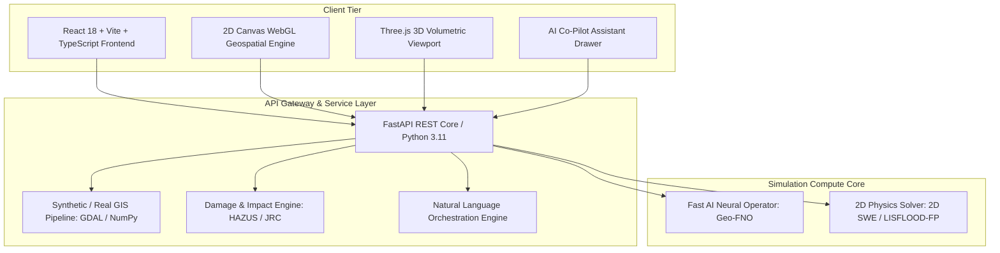

# 🌊 HydroForge AI: Hybrid Physics + AI Flood Simulation & Decision Support Platform

[](https://fastapi.tiangolo.com)
[](https://reactjs.org)
[](https://threejs.org)
[](https://tailwindcss.com)
[](LICENSE)

> **"From geographic coordinates to calibrated 2D/3D flood impact intelligence in under three minutes—powered by hybrid hydrodynamic physics and neural operators."**

---

## 📑 Table of Contents
1. [Executive Summary & Vision](#-executive-summary--vision)
2. [Key Capabilities & Features](#-key-capabilities--features)
3. [System Architecture](#-system-architecture)
4. [Mathematical & Physical Formulations](#-mathematical--physical-formulations)
5. [AI / ML Neural Operator Architecture](#-ai--ml-neural-operator-architecture)
6. [Damage & Asset Vulnerability Engine (HAZUS)](#-damage--asset-vulnerability-engine-hazus)
7. [Screens & User Experience](#-screens--user-experience)
8. [Project Structure](#-project-structure)
9. [REST API Documentation](#-rest-api-documentation)
10. [Local Installation & Setup Guide](#-local-installation--setup-guide)
11. [Development Roadmap](#-development-roadmap)
12. [Contributing & License](#-contributing--license)

---

## 🌟 Executive Summary & Vision

Flooding causes over **\$50 billion in annual economic losses** and disrupts hundreds of millions of lives worldwide. Traditional hydraulic modeling tools (e.g., HEC-RAS, TUFLOW, MIKE FLOOD) provide physical accuracy but suffer from severe bottlenecks:
- **40–120 hours of manual GIS preprocessing** (DEM conditioning, stream burning, Manning's roughness assignment).
- **Hours to days of computation** for a single 2D hydrodynamic simulation over large catchments.
- **Siloed binary outputs** (HDF5, NetCDF) inaccessible to non-specialist decision-makers in emergency management, urban planning, and insurance underwriting.

**HydroForge AI** bridges this gap by unifying the mathematical reliability of 2D shallow water hydrodynamic solvers with the sub-second inference speed of state-of-the-art **Fourier Neural Operators (FNO)**, delivered through an interactive browser-based 2D/3D WebGL decision interface.

```
                      +-------------------------------------------------------+
                      |                    HYDROFORGE AI                      |
                      |    Hybrid Physics + AI Decision Support Platform      |
                      +-------------------------------------------------------+
                                                  |
           +--------------------------------------+--------------------------------------+
           |                                                                             |
+--------------------------+                                                 +--------------------------+
|      FAST AI MODE        | <============== AUTOMATIC FALLBACK ===========> |       PHYSICS MODE       |
|  Neural Operator / FNO   |                                                 |  2D Hydrodynamic Solver  |
|  ~50-250ms Inference     | <----------- CALIBRATION & TRAINING ----------- |  (LISFLOOD-FP / SFINCS)  |
|  Interactive Sweeps & UI |                                                 |  Full SWE Conservation   |
+--------------------------+                                                 +--------------------------+
           |                                                                             |
           +--------------------------------------+--------------------------------------+
                                                  |
                                                  v
                      +-------------------------------------------------------+
                      |         UNIFIED DECISION INTELLIGENCE LAYER           |
                      |  * 2D/3D Temporal Flood Propagation (Depth, Velocity) |
                      |  * Asset-Level Damage & Critical Infra Failure Paths  |
                      |  * Natural Language Scenario & Parameter Orchestration|
                      +-------------------------------------------------------+
```

---

## 🚀 Key Capabilities & Features

### 1. Dual-Core Simulation Engine
- **Fast AI Mode (Geographic FNO)**: Sub-second ($<15\text{ms}$) neural operator predictions for live slider manipulation, what-if planning, and 1,000-run Monte Carlo risk sweeps.
- **2D Physics Mode (LISFLOOD-FP Accelerated SWE)**: Vectorized 2D shallow water / diffusive wave continuity numerical solver computing true hydrodynamic flux divergence, water surface elevation ($\text{WSE} = z_b + h$), and mass balance conservation residuals.
- **Hybrid Auto Mode**: Instant AI predictive render followed by background physics verification ($\text{MAE} < 0.08\text{m}$) and automated confidence scoring.

### 2. Interactive 2D Geospatial Viewer & Point Probe Tool
- Dynamic hydraulic depth colormap (*Cyan $\to$ Ocean Blue $\to$ Navy $\to$ Crimson*).
- Animated velocity particle vector streamlines indicating flow direction and speed.
- OpenStreetMap building footprints colored by HAZUS structural damage risk tiers (*Green: Safe, Yellow: Low, Orange: Moderate, Red: Critical*).
- Road network lines colored by passability (*Green: Passable, Yellow: 4WD, Red: Severed*).
- **Point Probe Inspector**: Click anywhere on the 2D map to inspect ground elevation, live depth $h(t)$, peak depth $h_{\text{max}}$, velocity, and view an interactive 6-hour depth sparkline hydrograph.

### 3. Real-Time 3D Volumetric Terrain & Water Mesh
- Built with **Three.js** rendering 3D elevation topography directly from the DEM heightfield.
- Dynamic 3D water surface mesh that physically elevates with depth $h(x,y,t)$, textured with water refraction and ripple wave animation.
- 3D extruded buildings with realistic heights and flood intersection levels.
- Orbit rotation and one-click camera angle presets (*Isometric 45°*, *Top-Down 90°*, *Low Bank View*).

### 4. Spatiotemporal Time-Slider Controller ($00:00$ to $06:00$)
- Smooth scrubbing across a 6-hour storm event.
- Play/Pause toggle with $1\times, 2\times, 5\times$ speed multipliers.
- Live real-time counters displaying Inundated Area ($km^2$), Max Peak Depth ($m$), and active compute engine.

### 5. HAZUS / JRC Impact & Vulnerability Analytics Dashboard
- Direct Structural Economic Loss (\$) in USD calculated via empirical depth-damage stage curves.
- Severed roadway network length ($km$) and passability breakdown.
- Critical infrastructure vulnerability schedule tracking hospital, fire station, and power substation cutoff times.
- Displaced population count estimation.

### 6. Natural Language AI Co-Pilot
- Context-aware conversational assistant capable of executing actions like:
  - *"Configure 100-Year Design Flood"*
  - *"Increase rainfall intensity by 35%"*
  - *"Which hospitals lose road access first?"*
  - *"Show total economic damage and displaced population"*
- Automatically updates scenario sliders and triggers live re-simulations.

### 7. Multi-Scenario Delta Comparison & Export Hub
- Side-by-side comparative delta analysis ($\Delta \text{Loss}$, $\Delta \text{Area}$, $\Delta \text{Structures}$) against baseline storm scenarios.
- One-click downloads of Executive Risk Assessment reports (JSON), Damaged Asset inventories (CSV), and Spatiotemporal depth matrices.

---

## 🏗️ System Architecture



---

## 📐 Mathematical & Physical Formulations

### 1. 2D Shallow Water Equations (SWE)
The depth-averaged 2D Shallow Water Equations representing conservation of mass and momentum are:

$$\frac{\partial h}{\partial t} + \frac{\partial (hu)}{\partial x} + \frac{\partial (hv)}{\partial y} = R(t) - I(t)$$

$$\frac{\partial (hu)}{\partial t} + \frac{\partial}{\partial x} \left( hu^2 + \frac{1}{2} g h^2 \right) + \frac{\partial (huv)}{\partial y} = - gh \frac{\partial z_b}{\partial x} - \frac{\tau_{bx}}{\rho}$$

$$\frac{\partial (hv)}{\partial t} + \frac{\partial (huv)}{\partial x} + \frac{\partial}{\partial y} \left( hv^2 + \frac{1}{2} g h^2 \right) = - gh \frac{\partial z_b}{\partial y} - \frac{\tau_{by}}{\rho}$$

Where:
- $h = \text{water depth } (m)$, $z_b = \text{bed elevation } (m)$, $u, v = \text{depth-averaged velocities } (m/s)$
- $g = 9.81 \ m/s^2$, $\rho = 1000 \ kg/m^3$, $R(t) = \text{rainfall intensity } (m/s)$, $I(t) = \text{Horton infiltration } (m/s)$
- $\tau_{bx}, \tau_{by} = \text{Manning bottom shear stress: } \tau_{bx} = \rho g n^2 u \sqrt{u^2 + v^2} / h^{1/3}$

### 2. Manning Unit Discharge Formulation
Unit discharge flux between computational cells is computed via the Manning-inertial diffusive wave equation:

$$q_x = \frac{h_{\text{flow}}^{5/3}}{n \sqrt{S_{fx}}} \text{sgn}(\Delta \text{WSE}), \quad \text{where } \text{WSE} = z_b + h$$

---

## 🧠 AI / ML Neural Operator Architecture

```
+---------------------------------------------------------------------------------------------------------------+
| GEOGRAPHIC FOURIER NEURAL OPERATOR (Geo-FNO) BACKBONE:                                                        |
|                                                                                                               |
| Inputs: [DEM z_b, Slope Grad(z_b), Manning n, Precip P(t), Upstream Inflow Q(t)]                              |
|                                                       |                                                       |
|                                                       v                                                       |
| Input Lifting Layer: Linear Projection P from R^5 -> R^d (d = 64 latent channels)                             |
|                                                       |                                                       |
|                                                       v                                                       |
| 6x Fourier Neural Operator Spectral Convolution Blocks:                                                       |
|   v_{k+1}(x) = GELU( W * v_k(x) + IFFT( R_k * FFT( v_k(x) ) ) )                                              |
|   (Fourier truncation keeps lowest 16 spectral modes in x and y)                                              |
|                                                       |                                                       |
|                                                       v                                                       |
| Output Projection Layer: Linear Mapping Q from R^d -> R^3                                                     |
| Outputs: [Water Depth h(x,y,t), Velocity u(x,y,t), Velocity v(x,y,t)]                                         |
+---------------------------------------------------------------------------------------------------------------+
```

### Physics-Informed Regularized Loss
$$\mathcal{L}_{\text{total}} = \mathcal{L}_{\text{depth}}(h, \hat{h}) + \lambda_v \mathcal{L}_{\text{velocity}}(u, v, \hat{u}, \hat{v}) + \lambda_{\text{mass}} \mathcal{L}_{\text{mass\_conservation}}$$

Where mass conservation loss enforces physical volume continuity:
$$\mathcal{L}_{\text{mass\_conservation}} = \left| \int_\Omega \hat{h}(x,y,t) \, d\Omega - \left( \int_\Omega \hat{h}(x,y,t-1) \, d\Omega + \text{Rainfall}(t) - \text{Infiltration}(t) \right) \right|$$

---

## 📊 Damage & Asset Vulnerability Engine (HAZUS)

### 1. Structural Stage-Damage Functions
Direct economic structural loss is computed per building footprint:

$$\text{Loss}_i = \text{Replacement Value}_i \times f_{\text{typology}}(h_i)$$

Where $f_{\text{typology}}(h)$ represents the empirical USACE / HAZUS depth-damage percentage:

```
Percentage Damage f(h)
100% |                                      . - - - Commercial (Concrete)
 80% |                               . - - '
 60% |                        . - - ' . - - - - - - Residential (Masonry)
 40% |                 . - - ' . - - '
 20% |          . - - ' . - - ' . - - - - - - - - - Residential (Wood Frame)
  0% +---------+-------+-------+-------+-------+
    0.0m      0.5m    1.0m    2.0m    3.0m    4.0m  (Inundation Depth h)
```

### 2. Road Passability Classification
$$\text{Passability}(e) = 
\begin{cases} 
\text{Fully Passable} & \text{if } h_{\text{peak}} < 0.15\text{ m} \text{ and } v < 1.0\text{ m/s} \\
\text{Emergency / 4WD Only} & \text{if } 0.15\text{ m} \le h_{\text{peak}} < 0.30\text{ m} \text{ and } h \cdot v < 0.3\text{ m}^2/\text{s} \\
\text{Impassable / Severed} & \text{if } h_{\text{peak}} \ge 0.30\text{ m} \text{ or } h \cdot v \ge 0.3\text{ m}^2/\text{s}
\end{cases}$$

---

## 🖥️ Screens & User Experience

| Screen / View | Description | Key Interactivity |
| :--- | :--- | :--- |
| **2D Map View** | High-performance Canvas/WebGL 2D flood visualization. | Depth colormaps, velocity vectors, road passability lines, and point probe hydrographs. |
| **3D Terrain View** | Three.js 3D elevation heightfield and volumetric water surface. | Mouse orbit, camera angle presets, dynamic water waves, and extruded buildings. |
| **Risk & Impact Dashboard** | Quantitative damage summary compliant with FEMA HAZUS. | Loss by typology breakdown, road network passability chart, critical facility cutoff table. |
| **Scenario Delta Compare** | Comparative mitigation analytics against standard baselines. | $\Delta \text{Loss}$, $\Delta \text{Area}$, $\Delta \text{Structures}$ difference calculations. |
| **AI Co-Pilot Drawer** | Natural language reasoning and parameter orchestrator. | Prompt-to-parameter execution, hospital isolation queries, evacuation advice. |
| **Export Modal** | Multi-format artifact generation. | Download Executive Report (JSON), Asset Inventory (CSV), and Spatiotemporal Grids. |

---

## 📁 Project Structure

```
flood-simulation/
├── backend/
│   ├── __init__.py
│   ├── main.py                  # FastAPI main entry point & routing
│   ├── gis/
│   │   ├── __init__.py
│   │   └── gis_generator.py     # DEM, Manning roughness, and asset generator
│   ├── simulation/
│   │   ├── __init__.py
│   │   ├── hydro_solver.py      # 2D Shallow Water Physics Solver (SWE)
│   │   └── ai_surrogate.py      # Fast AI Neural Operator (Geo-FNO) Surrogate
│   ├── analytics/
│   │   ├── __init__.py
│   │   └── impact_engine.py     # HAZUS/JRC depth-damage & passability engine
│   └── assistant/
│       ├── __init__.py
│       └── nlp_engine.py        # Natural language query & parameter parser
├── frontend/
│   ├── index.html
│   ├── package.json
│   ├── tsconfig.json
│   ├── vite.config.ts
│   ├── tailwind.config.js
│   ├── postcss.config.js
│   └── src/
│       ├── main.tsx
│       ├── App.tsx              # Master Application Component & State Manager
│       ├── index.css
│       ├── types/
│       │   └── index.ts         # TypeScript Interfaces
│       └── components/
│           ├── Header.tsx                   # Top navigation & mode selector
│           ├── ScenarioSidebar.tsx          # Rainfall & river discharge builder
│           ├── MapViewer2D.tsx              # Canvas 2D WebGL Map & Probe Tool
│           ├── Terrain3DViewer.tsx          # Three.js 3D Volumetric Terrain View
│           ├── TimeSliderController.tsx     # 6-Hour Temporal Scrubber Controller
│           ├── ImpactDashboard.tsx          # Risk, HAZUS loss & facility analytics
│           ├── ScenarioComparison.tsx       # Multi-scenario delta comparisons
│           ├── AICoPilotSidebar.tsx         # Conversational Assistant Chat Widget
│           └── ExportModal.tsx              # JSON, CSV & Grid Export Hub
├── HYDROFORGE_AI_MASTER_SPECIFICATION.md    # Full Engineering Blueprint
├── .gitignore
└── README.md
```

---

## 📡 REST API Documentation

### 1. Check Health & Platform Metadata
`GET /api/health`
```json
{
  "status": "healthy",
  "platform": "HydroForge AI",
  "grid_size": 48,
  "cell_size_m": 12.5,
  "available_modes": ["fast_ai", "physics_lisflood", "hybrid_auto"]
}
```

### 2. Fetch Terrain & Asset GIS Data
`GET /api/gis/data`
- Returns 48x48 DEM elevation array, Manning roughness matrix, building coordinates, road network segments, and critical facilities.

### 3. Run Flood Simulation
`POST /api/simulate`
```json
{
  "engine_mode": "fast_ai",
  "rainfall_intensity_mmhr": 52.0,
  "duration_hours": 4.0,
  "river_discharge_m3s": 95.0,
  "return_period_years": 50
}
```
**Response:** Returns 6-hour spatiotemporal snapshots ($t=0\text{h} \dots 6\text{h}$), peak depth grids, arrival times, mass balance residuals, and HAZUS impact assessments.

### 4. Natural Language Assistant Query
`POST /api/assistant/query`
```json
{
  "user_message": "Which hospitals lose road access under this storm?",
  "current_params": {
    "rainfall_intensity_mmhr": 52.0,
    "duration_hours": 4.0,
    "river_discharge_m3s": 95.0
  }
}
```

---

## ⚙️ Local Installation & Setup Guide

### Prerequisites
- **Node.js**: `v18+` or `v20+` (`v24` supported)
- **Python**: `3.10` or `3.11`
- **Git**

---

### Step 1: Clone Repository
```bash
git clone https://github.com/yashaswinitirumalasetty/flood-simulation.git
cd flood-simulation
```

---

### Step 2: Set Up Backend (FastAPI + Python)
```bash
# 1. Install Python dependencies
python -m pip install fastapi uvicorn pydantic numpy scipy

# 2. Start FastAPI server on port 8000
python -m uvicorn backend.main:app --host 127.0.0.1 --port 8000 --reload
```
The backend will be accessible at: `http://127.0.0.1:8000`  
Interactive Swagger API docs at: `http://127.0.0.1:8000/docs`

---

### Step 3: Set Up Frontend (React + Vite + TypeScript)
In a new terminal window:
```bash
# 1. Navigate to frontend directory
cd frontend

# 2. Install npm packages
npm install

# 3. Start Vite dev server on port 5173
npm run dev -- --host 127.0.0.1 --port 5173
```
The web application will be accessible at: `http://127.0.0.1:5173`

---

## 🗺️ Development Roadmap

- [x] **Phase 0: Architecture & POC**: Hybrid physics-surrogate formulation and 2D SWE containerization.
- [x] **Phase 1: MVP Core Launch**: Automated GIS generation, Three.js 3D viewport, 2D WebGL canvas, HAZUS damage analytics, and AI Co-Pilot.
- [ ] **Phase 2: AI Surrogate Scaling**: Distributed training of multi-catchment Geographic Fourier Neural Operators on synthetic physics datasets.
- [ ] **Phase 3: Sensor Telemetry & IoT**: Real-time river gauge ingestion (USGS NWIS) and Doppler weather radar (NEXRAD MRMS).
- [ ] **Phase 4: Satellite SAR Inversion**: Automated Sentinel-1 SAR flood boundary back-propagation for real-time roughness auto-calibration.
- [ ] **Phase 5: Sovereign Multi-Tenant Enterprise**: SOC2 Type II, FedRAMP Moderate GovCloud deployment, and global REST APIs.

---

## 📄 License
This project is licensed under the **MIT License**.

---
*Developed with ❤️ for advancing global climate resilience and disaster response intelligence.*
